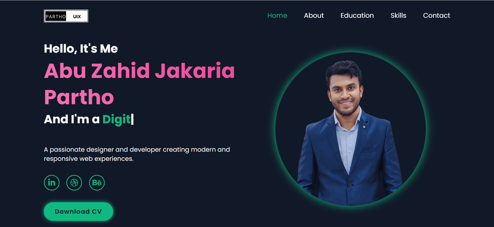

# Personal Portfolio Website of Abu Zahid Jakaria Partho 👨‍💻

Welcome to the official source code repository for my personal portfolio website. This project is a showcase of my skills, projects, and my journey into the world of frontend development. It's designed to be clean, modern, and fully responsive.

[](https://mahbeerpartho.vercel.app/)

### 🚀 Live Demo

You can view the live version of my portfolio here:
[**https://mahbeerpartho.vercel.app/**](https://mahbeerpartho.vercel.app/)

---

### 🖼️ Preview



---

### 📝 About The Project

This portfolio serves as a comprehensive showcase of my skills and projects as a Frontend Developer. The primary goal is to introduce myself, highlight my technical abilities, display my work, and provide an easy way for visitors to connect with me.

---

### ✨ Features

-   **Fully Responsive Design:** The layout seamlessly adapts to all device screens (desktop, tablet, and mobile).
-   **Modern UI/UX:** A clean, modern, and user-friendly interface.
-   **Projects Section:** Displays a curated list of my projects with descriptions, live links, and links to the source code.
-   **Skills Section:** Highlights the programming languages, frameworks, and tools I am proficient in.
-   **Interactive Elements:** Smooth scrolling, animations, and hover effects for an engaging user experience.

---

### 🛠️ Tech Stack

This project was built using the following technologies:


---

### ⚙️ Getting Started

If you want to run this project on your local machine, follow the steps below:

1.  **Clone the repository:**
    ```sh
    git clone [https://github.com/your-username/your-repo-name.git](https://github.com/your-username/your-repo-name.git)
    ```
2.  **Navigate into the project directory:**
    ```sh
    cd your-repo-name
    ```
3.  **Install NPM packages:**
    ```sh
    npm install
    ```
4.  **Run the development server:**
    ```sh
    npm run dev
    ```
    Then, open `http://localhost:5173` (or the port shown in your terminal) in your browser.

---

### 🤝 Connect with me

Feel free to reach out if you like my work or want to discuss anything.

[]([https://www.linkedin.com/in/your-linkedin-profile/](https://www.linkedin.com/in/parthobd-ui/))
[](mailto:Zahid10-2107@diu.edu.bd)
